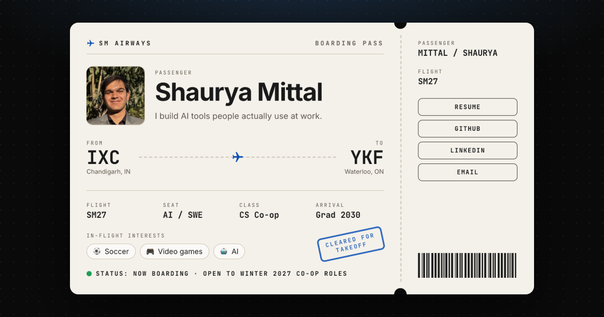

# SM Airways ✈️ | Shaurya Mittal's portfolio

**Live: [shauryamittal.net](https://www.shauryamittal.net)**

[](https://www.shauryamittal.net)

An aviation-themed portfolio. Visitors board a flight through my work: a boarding pass introduces me, a split-flap departures board lists my internships and projects, and a route map shows the places that shaped me.

## What's on board

- **Boarding pass:** who I am, where I'm from (IXC → YKF), and quick links to my resume, GitHub, LinkedIn, and email
- **Departures board:** internships and projects as flights, with split-flap letters that flip into place; select a flight for details
- **Flights I've taken:** a hub map with Waterloo in the middle; each destination opens a postcard with its story
- **Baggage claim:** skills as luggage tags on carousel belts
- **Arrivals:** how to reach me
- **In between:** a "Ready for takeoff?" intro, and a banner-towing plane that crosses the screen between sections as you scroll

The site is built to be accessible. It supports keyboard navigation and screen readers, respects reduced-motion settings, meets AA contrast in light and dark mode, and works without JavaScript.

## Tech

[Next.js](https://nextjs.org) (static export) · TypeScript · Tailwind CSS · hand-drawn SVG · deployed on [Vercel](https://vercel.com)

## Run it locally

```bash
npm install
npm run dev      # http://localhost:3000
npm run build    # static site in out/
```

## Editing content

All text lives in [`content/data.ts`](content/data.ts):

| To change… | Edit |
| --- | --- |
| Name, tagline, links, status | `profile` |
| About section | `about` |
| Departures board (internships and projects) | `flights` |
| Route map destinations (add a trip and it's placed automatically) | `destinations` |
| Skills | `skills` |

Photos go in `public/images/`, and destination photos go in `public/images/destinations/`.
